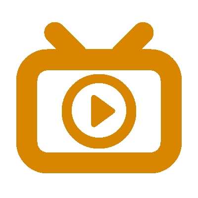
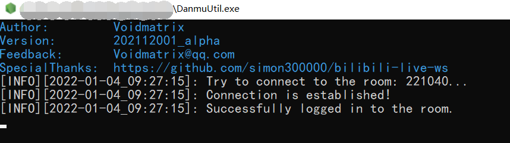

    

        
    

    <h1 align="center">DanmuGame</h1>
    
Bilibili 直播间弹幕控制游戏快速开发框架

    

        
        
        
        
        
        
       
    

     

> 本项目基于 [bilibili-live-ws](https://github.com/simon300000/bilibili-live-ws) 开发，在此特别感谢为本项目开拓道路的大佬们 ~

## 程序结构及流程

## 项目依赖项

DanmuUtil 直播间监听程序依赖于 `bilibili-live-ws` 等库，可以直接通过 `npm install` 安装相关依赖；在 Release 版本中，DanmuUtil 程序已打包为 `.exe` 形式，方便无 Node.js 环境的设备开箱即用。

DanmuGame 游戏框架和 VisualDebugTool 调试器项目提供了基于 VisualStudio 2019 的 x64 版本项目工程，可以直接拉取到本地进行编译，如需在其他编译器环境或其他平台下编译，请先编译并配置如下依赖库：
| 库名称                  | 网址                                                                                     | 协议                |
|-------------------------|------------------------------------------------------------------------------------------|---------------------|
| **Lua - 5.4.0**         | [http://www.lua.org/](http://www.lua.org/)                                               | MIT                 |
| **SDL - 2.0.14**        | [https://www.libsdl.org/](https://www.libsdl.org/)                                       | zlib license        |
| **SDL_image - 2.0.5**   | [https://www.libsdl.org/projects/SDL_image/](https://www.libsdl.org/projects/SDL_image/) | zlib license        |
| **SDL_gfx - 1.0.4**     | [https://sourceforge.net/projects/sdlgfx/](https://sourceforge.net/projects/sdlgfx/)     | zlib/libpng license |
| **SDL_mixer - 2.0.4**   | [https://www.libsdl.org/projects/SDL_mixer/](https://www.libsdl.org/projects/SDL_mixer/) | zlib license        |
| **SDL_ttf - 2.0.15**    | [https://www.libsdl.org/projects/SDL_ttf/](https://www.libsdl.org/projects/SDL_ttf/)     | zlib license        |
| **cpp-httplib - 0.8.4** | [https://github.com/yhirose/cpp-httplib/](https://github.com/yhirose/cpp-httplib/)       | MIT                 |
| **cJSON - 1.7.14**      | [https://github.com/DaveGamble/cJSON/](https://github.com/DaveGamble/cJSON/)             | MIT                 |
| **imgui - 1.86**        | [https://github.com/ocornut/imgui/](https://github.com/ocornut/imgui/)                   | MIT                 |

## 快速上手

发布版本中提供了开箱即用的程序，首先在 `config.json` 中配置好直播间信息及游戏设置（详细配置内容见稍后描述），然后启动 DanmuUtil 程序，当程序显示如下内容时证明启动并连接成功：

接下来启动 `DanmuGame.exe`，程序将自动加载并执行 `GameScript.lua` 中的脚本内容，调整直播画面到游戏窗口即可。

## 配置文件 `Config.json` 详解
+ `room`：需要监听的直播间房间号（完整房间号，非短房间号）
+ `port`：DanmuUtil 程序和 DanmuGame 游戏框架在本地通信的端口号
+ `window-title`：游戏窗口标题文本
+ `window-size`：游戏窗口尺寸
    - `width`：游戏窗口宽度（单位：像素）
    - `height`：游戏窗口高度（单位：像素）
+ `full-screen`：游戏窗口全屏（将覆盖游戏窗口尺寸设置）
+ `max-fps`：游戏最高帧率，设置过大的最高帧率可能导致实际帧率不稳定（建议区间：60 ~ 144）
+ `linear-filtering`：对游戏画面开启线性过滤抗锯齿（某些需要对图片素材缩放的像素风游戏可能不适合开启）

## 游戏脚本编写及 API 详解

`GameScript.lua` 将作为游戏逻辑的入口脚本进行加载运行，使用 `Lua 5.4` 语法编写，请确保已在脚本环境中声明 `__EventHandler` 函数和 `__MainUpdate` 函数，这两个函数会分别在 **直播间事件更新**（如弹幕发送）和 **游戏画面帧更新** 时被调用：
+ 对于函数 `__EventHandler(event, data)`，第一个参数 `event` 是代表当前事件类型的字符串，第二个参数包含了事件相关数据，可能的值如下：
    | 值          | 事件         | 数据                                                 |
    |-------------|--------------|------------------------------------------------------|
    | `"ENTER"`   | 观众进入房间 | `data.username` 观众昵称                             |
    | `"MESSAGE"` | 观众发送弹幕 | `data.username` 观众昵称 `data.username` 弹幕内容 |
+ 对于函数 `__MainUpdate()`，程序会在每次尝试刷新游戏画面时调用此函数，可以在函数内编写游戏画面渲染相关的逻辑；

---

    
🕹 游戏控制相关 API

### QuitGame()
+ **功能：** 退出游戏
+ **参数简介：** 无
+ **返回值简介：** 无

    
🖥 游戏窗口相关 API

### SetTitle(title)
+ **功能：** 设置窗口标题
+ **参数简介：** 
    | 参数    | 类型     | 简介     |
    |:--------|:---------|:---------|
    | `title` | `string` | 窗口标题 |
+ **返回值简介：** 无

### title = GetTitle()
+ **功能：** 获取窗口标题
+ **参数简介：** 无
+ **返回值简介：** 
    | 返回值  | 类型     | 简介     |
    |:--------|:---------|:---------|
    | `title` | `string` | 窗口标题 |

### width, height = GetWindowSize()
+ **功能：** 获取窗口尺寸
+ **参数简介：** 无
+ **返回值简介：** 
    | 返回值   | 类型     | 简介                   |
    |:---------|:---------|:-----------------------|
    | `width`  | `number` | 窗口宽度（单位：像素） |
    | `height` | `number` | 窗口高度（单位：像素） |

    
🖼 游戏画面相关 API

### SetDrawColor(color)
+ **功能：** 设置绘图颜色
+ **参数简介：** 
    | 参数    | 类型    | 简介     |
    |:--------|:--------|:---------|
    | `color` | `table` | 绘图颜色 |
+ **返回值简介：** 无

### color = GetDrawColor()
+ **功能：** 设置绘图颜色
+ **参数简介：** 无
+ **返回值简介：** 
    | 返回值  | 类型    | 简介     |
    |:--------|:--------|:---------|
    | `color` | `table` | 绘图颜色 |

### DrawPoint(point)
+ **功能：** 绘制像素点
+ **参数简介：** 
    | 参数    | 类型    | 简介   |
    |:--------|:--------|:-------|
    | `point` | `table` | 点坐标 |
+ **返回值简介：** 无

### DrawLine(begin, end)
+ **功能：** 绘制线段
+ **参数简介：** 
    | 参数    | 类型    | 简介       |
    |:--------|:--------|:-----------|
    | `begin` | `table` | 起始点坐标 |
    | `end`   | `table` | 结束点坐标 |
+ **返回值简介：** 无

### DrawRectangle(rect, fill)
+ **功能：** 绘制矩形
+ **参数简介：** 
    | 参数   | 类型      | 简介                   |
    |:-------|:----------|:-----------------------|
    | `rect` | `table`   | 矩形坐标和尺寸         |
    | `fill` | `boolean` | 是否填充，默认为 false |
+ **返回值简介：** 无

### DrawRoundRectangle(rect, radius, fill)
+ **功能：** 绘制圆角矩形
+ **参数简介：** 
    | 参数     | 类型      | 简介                   |
    |:---------|:----------|:-----------------------|
    | `rect`   | `table`   | 矩形坐标和尺寸         |
    | `radius` | `number`  | 圆角所在圆的半径       |
    | `fill`   | `boolean` | 是否填充，默认为 false |
+ **返回值简介：** 无

### DrawCircle(center, radius, fill)
+ **功能：** 绘制圆形
+ **参数简介：** 
    | 参数     | 类型      | 简介                   |
    |:---------|:----------|:-----------------------|
    | `center` | `table`   | 圆心坐标               |
    | `radius` | `number`  | 圆半径                 |
    | `fill`   | `boolean` | 是否填充，默认为 false |
+ **返回值简介：** 无

### DrawEllipse(center, radius_x, radius_y, fill)
+ **功能：** 绘制椭圆形
+ **参数简介：** 
    | 参数       | 类型      | 简介                   |
    |:-----------|:----------|:-----------------------|
    | `center`   | `table`   | 椭圆中心坐标           |
    | `radius_x` | `number`  | 椭圆 X 方向半径        |
    | `radius_y` | `number`  | 椭圆 Y 方向半径        |
    | `fill`     | `boolean` | 是否填充，默认为 false |
+ **返回值简介：** 无

### DrawPie(center, radius, start, end, fill)
+ **功能：** 绘制扇形
+ **参数简介：** 
    | 参数     | 类型      | 简介                     |
    |:---------|:----------|:-------------------------|
    | `center` | `table`   | 扇形所在圆的圆心坐标     |
    | `radius` | `number`  | 扇形所在圆的半径         |
    | `start`  | `number`  | 起始角度，逆时针为正方向 |
    | `end`    | `number`  | 结束角度，逆时针为正方向 |
    | `fill`   | `boolean` | 是否填充，默认为 false   |
+ **返回值简介：** 无

### DrawTriangle(point_1, point_2, point_3, fill)
+ **功能：** 绘制三角形
+ **参数简介：** 
    | 参数      | 类型      | 简介                   |
    |:----------|:----------|:-----------------------|
    | `point_1` | `table`   | 三角形第一个顶点坐标   |
    | `point_2` | `table`   | 三角形第二个顶点坐标   |
    | `point_3` | `table`   | 三角形第三个顶点坐标   |
    | `fill`    | `boolean` | 是否填充，默认为 false |
+ **返回值简介：** 无

### DrawPolygon(point_list, fill)
+ **功能：** 绘制多边形（凸多边形）
+ **参数简介：** 
    | 参数         | 类型      | 简介                     |
    |:-------------|:----------|:-------------------------|
    | `point_list` | `table`   | 多边形顶点坐标构成的数组 |
    | `fill`       | `boolean` | 是否填充，默认为 false   |
+ **返回值简介：** 无

### DrawBezier(point_list, steps)
+ **功能：** 绘制贝塞尔曲线
+ **参数简介：** 
    | 参数         | 类型     | 简介                     |
    |:-------------|:---------|:-------------------------|
    | `point_list` | `table`  | 多边形顶点坐标构成的数组 |
    | `steps`      | `number` | 插值步数                 |
+ **返回值简介：** 无

### sprite = LoadSprite(path)
+ **功能：** 加载贴图
+ **参数简介：** 
    | 参数   | 类型     | 简介         |
    |:-------|:---------|:-------------|
    | `path` | `string` | 贴图文件路径 |
+ **返回值简介：** 
    | 返回值   | 类型           | 简介                               |
    |:---------|:---------------|:-----------------------------------|
    | `sprite` | `userdata/nil` | 加载成功返回贴图数据，失败返回 nil |

### SetSpriteAlpha(sprite, alpha)
+ **功能：** 设置贴图透明度
+ **参数简介：** 
    | 参数     | 类型       | 简介                           |
    |:---------|:-----------|:-------------------------------|
    | `sprite` | `userdata` | 贴图数据                       |
    | `alpha`  | `number`   | 贴图透明度，取值范围为 0 ~ 255 |
+ **返回值简介：** 无

### width, height = GetSpriteSize(sprite)
+ **功能：** 获取贴图尺寸
+ **参数简介：** 
    | 参数     | 类型       | 简介     |
    |:---------|:-----------|:---------|
    | `sprite` | `userdata` | 贴图数据 |
+ **返回值简介：** 
    | 返回值   | 类型     | 简介                 |
    |:---------|:---------|:---------------------|
    | `width`  | `number` | 贴图宽度，单位：像素 |
    | `height` | `number` | 贴图高度，单位：像素 |

### RenderSprite(sprite, rect_show, rect_clip)
+ **功能：** 渲染贴图
+ **参数简介：** 
    | 参数        | 类型       | 简介                                         |
    |:------------|:-----------|:---------------------------------------------|
    | `sprite`    | `userdata` | 贴图数据                                     |
    | `rect_show` | `table`    | 贴图显示区域的坐标和尺寸                     |
    | `rect_clip` | `table`    | 贴图裁剪区域的坐标和尺寸，默认为完整贴图部分 |
+ **返回值简介：** 无

### RenderSpriteEx(sprite, rect_show, rect_clip, center, angle, mode)
+ **功能：** 使用高级模式渲染贴图
+ **参数简介：** 
    | 参数        | 类型       | 简介                                                                                          |
    |:------------|:-----------|:----------------------------------------------------------------------------------------------|
    | `sprite`    | `userdata` | 贴图数据                                                                                      |
    | `rect_show` | `table`    | 贴图显示区域的坐标和尺寸                                                                      |
    | `rect_clip` | `table`    | 贴图裁剪区域的坐标和尺寸，默认为完整贴图部分                                                  |
    | `center`    | `table`    | 贴图旋转中心                                                                                  |
    | `angle`     | `number`   | 贴图旋转角度，逆时针为正方向                                                                  |
    | `mode`      | `table`    | 描述旋转模式的数组，成员可能的值为： `"H"`表示水平翻转，`"V"`表示竖直翻转，`"N"`表示不翻转 |
+ **返回值简介：** 无

### font = LoadFont(path, size)
+ **功能：** 加载字体
+ **参数简介：** 
    | 参数   | 类型     | 简介                                |
    |:-------|:---------|:------------------------------------|
    | `path` | `string` | 字体文件路径                        |
    | `size` | `string` | 字体大小，通常为 72DPI 下的像素高度 |
+ **返回值简介：** 
    | 返回值 | 类型           | 简介                               |
    |:-------|:---------------|:-----------------------------------|
    | `font` | `userdata/nil` | 加载成功返回字体数据，失败返回 nil |

### style = GetFontStyle(font)
+ **功能：** 获取字体样式
+ **参数简介：** 
    | 参数   | 类型       | 简介     |
    |:-------|:-----------|:---------|
    | `font` | `userdata` | 字体数据 |
+ **返回值简介：** 
    | 返回值  | 类型    | 简介                                                                                                                |
    |:--------|:--------|:--------------------------------------------------------------------------------------------------------------------|
    | `style` | `table` | 字体样式数组，成员可能的值为： `"B"`表示粗体，`"I"`表示斜体，`"U"`表示下划线，`"S"`表示删除线，`"N"`表示默认样式 |

### SetFontStyle(font, style)
+ **功能：** 设置字体样式
+ **参数简介：** 
    | 参数    | 类型       | 简介                             |
    |:--------|:-----------|:---------------------------------|
    | `font`  | `userdata` | 字体数据                         |
    | `style` | `table`    | 字体样式数组，成员可能的值见前述 |
+ **返回值简介：** 无

### height = GetFontHeight(font)
+ **功能：** 获取字体高度
+ **参数简介：** 
    | 参数   | 类型       | 简介     |
    |:-------|:-----------|:---------|
    | `font` | `userdata` | 字体数据 |
+ **返回值简介：** 
    | 返回值   | 类型     | 简介                 |
    |:---------|:---------|:---------------------|
    | `height` | `number` | 字体高度，单位：像素 |

### width, height = GetTextSize(font, text)
+ **功能：** 获取文本尺寸
+ **参数简介：** 
    | 参数   | 类型       | 简介     |
    |:-------|:-----------|:---------|
    | `font` | `userdata` | 字体数据 |
    | `text` | `string`   | 文本内容 |
+ **返回值简介：** 
    | 返回值   | 类型     | 简介                 |
    |:---------|:---------|:---------------------|
    | `width`  | `number` | 文本宽度，单位：像素 |
    | `height` | `number` | 文本高度，单位：像素 |

### sprite = CreateTextSprite(font, text, color)
+ **功能：** 创建文本贴图
+ **参数简介：** 
    | 参数    | 类型       | 简介     |
    |:--------|:-----------|:---------|
    | `font`  | `userdata` | 字体数据 |
    | `text`  | `string`   | 文本内容 |
    | `color` | `table`    | 文本颜色 |
+ **返回值简介：** 
    | 返回值   | 类型           | 简介                               |
    |:---------|:---------------|:-----------------------------------|
    | `sprite` | `userdata/nil` | 创建成功返回贴图数据，失败返回 nil |

    
🎼 音乐音效相关 API

### music = LoadMusic(path)
+ **功能：** 加载音乐
+ **参数简介：** 
    | 参数   | 类型     | 简介         |
    |:-------|:---------|:-------------|
    | `path` | `string` | 音乐文件路径 |
+ **返回值简介：** 
    | 返回值  | 类型           | 简介                               |
    |:--------|:---------------|:-----------------------------------|
    | `music` | `userdata/nil` | 加载成功返回音乐数据，失败返回 nil |

### PlayMusic(music, times, fading_time)
+ **功能：** 延时指定时间
+ **参数简介：** 
    | 参数          | 类型       | 简介                                   |
    |:--------------|:-----------|:---------------------------------------|
    | `music`       | `userdata` | 播放音乐                               |
    | `times`       | `number`   | 播放次数，-1 为循环播放                |
    | `fading_time` | `number`   | 淡入效果持续时间，默认为 0，单位：毫秒 |
+ **返回值简介：** 无

### StopMusic(fading_time)
+ **功能：** 停止正在播放的音乐
+ **参数简介：** 
    | 参数          | 类型     | 简介                                   |
    |:--------------|:---------|:---------------------------------------|
    | `fading_time` | `number` | 淡出效果持续时间，默认为 0，单位：毫秒 |
+ **返回值简介：** 无

### SetMusicPosition(position)
+ **功能：** 设置正在播放的音乐播放位置
+ **参数简介：** 
    | 参数       | 类型     | 简介                                                                                                                                                                                                                                                                                                                       |
    |:-----------|:---------|:---------------------------------------------------------------------------------------------------------------------------------------------------------------------------------------------------------------------------------------------------------------------------------------------------------------------------|
    | `position` | `number` | 播放位置，此操作仅支持以下三种格式的音乐，且参数意义各不相同： MOD：设置当前播放位置为此编码模型中对应索引的数据块处，0 将跳转至音乐开头； OGG：设置当前播放位置为从音乐开始位置计算的指定秒数处； MP3：设置当前播放位置为从当前播放位置计算的指定秒数处，可以先使用 RewindMusic 将当前音乐的播放位置重置到开始处 |
+ **返回值简介：** 无

### SetMusicVolume(volume)
+ **功能：** 设置音乐音量
+ **参数简介：** 
    | 参数     | 类型     | 简介                         |
    |:---------|:---------|:-----------------------------|
    | `volume` | `number` | 音乐音量，取值范围为 0 ~ 128 |
+ **返回值简介：** 无

### volume = GetMusicVolume()
+ **功能：** 获取音乐音量
+ **参数简介：** 无
+ **返回值简介：** 
    | 返回值   | 类型     | 简介                         |
    |:---------|:---------|:-----------------------------|
    | `volume` | `number` | 音乐音量，取值范围为 0 ~ 128 |

### PauseMusic()
+ **功能：** 暂停正在播放的音乐
+ **参数简介：** 无
+ **返回值简介：** 无

### ResumeMusic()
+ **功能：** 恢复当前暂停状态的音乐
+ **参数简介：** 无
+ **返回值简介：** 无

### RewindMusic()
+ **功能：** 重新播放当前正在播放的音乐
+ **参数简介：** 无
+ **返回值简介：** 无

### playing = CheckMusicPlaying()
+ **功能：** 判断当前音乐是否正在播放
+ **参数简介：** 无
+ **返回值简介：** 
    | 返回值    | 类型      | 简介                 |
    |:----------|:----------|:---------------------|
    | `playing` | `boolean` | 当前是否正在播放音乐 |

### paused = CheckMusicPaused()
+ **功能：** 判断当前音乐是否处于暂停状态
+ **参数简介：** 无
+ **返回值简介：** 
    | 返回值    | 类型      | 简介                     |
    |:----------|:----------|:-------------------------|
    | `playing` | `boolean` | 当前音乐是否处于暂停状态 |

### type = GetMusicFadingType()
+ **功能：** 判断当前音乐的淡入淡出状态
+ **参数简介：** 无
+ **返回值简介：** 
    | 返回值 | 类型     | 简介                                                                                                  |
    |:-------|:---------|:------------------------------------------------------------------------------------------------------|
    | `type` | `string` | 当前音乐的淡入淡出状态，可能的值为： `"O"`表示正在淡出，`"I"`表示正在淡入，`"N"`表示无淡入淡出效果 |

### sound = LoadSound(path)
+ **功能：** 加载音效
+ **参数简介：** 
    | 参数   | 类型     | 简介         |
    |:-------|:---------|:-------------|
    | `path` | `string` | 音效文件路径 |
+ **返回值简介：** 
    | 返回值  | 类型           | 简介                               |
    |:--------|:---------------|:-----------------------------------|
    | `sound` | `userdata/nil` | 加载成功返回音效数据，失败返回 nil |

### PlaySound(sound, times)
+ **功能：** 加载音效
+ **参数简介：** 
    | 参数    | 类型       | 简介                    |
    |:--------|:-----------|:------------------------|
    | `sound` | `userdata` | 音效数据                |
    | `times` | `number`   | 播放次数，-1 为循环播放 |
+ **返回值简介：** 无

### SetSoundVolume(sound, volume)
+ **功能：** 设置音效音量
+ **参数简介：** 
    | 参数     | 类型       | 简介                         |
    |:---------|:-----------|:-----------------------------|
    | `sound`  | `userdata` | 音效数据                     |
    | `volume` | `number`   | 音效音量，取值范围为 0 ~ 128 |
+ **返回值简介：** 无

### volume = GetSoundVolume(sound)
+ **功能：** 获取音效音量
+ **参数简介：** 
    | 参数    | 类型       | 简介     |
    |:--------|:-----------|:---------|
    | `sound` | `userdata` | 音效数据 |
+ **返回值简介：** 
    | 参数   | 类型     | 简介         |
    |:--------|:-----------|:---------|
    | `volume` | `number` | 音效音量，取值范围为 0 ~ 128 |

    
⏲ 时间控制相关 API

### Delay(time)
+ **功能：** 延时指定时间
+ **参数简介：** 
    | 参数   | 类型     | 简介                 |
    |:-------|:---------|:---------------------|
    | `time` | `number` | 延时时间，单位：毫秒 |
+ **返回值简介：** 无

### time = GetInitTime()
+ **功能：** 获取从程序初始化到现在的时间
+ **参数简介：** 无
+ **返回值简介：** 
    | 返回值 | 类型     | 简介                                 |
    |:-------|:---------|:-------------------------------------|
    | `time` | `number` | 从程序初始化到现在的时间，单位：毫秒 |

    
📌 数据存储相关 API

### json = LoadJSON(str)
+ **功能：** 加载 JSON 字符串为 Lua 数据
+ **参数简介：** 
    | 参数  | 类型     | 简介        |
    |:------|:---------|:------------|
    | `str` | `string` | JSON 字符串 |
+ **返回值简介：** 
    | 返回值 | 类型                              | 简介                               |
    |:-------|:----------------------------------|:-----------------------------------|
    | `json` | `nil/number/string/boolean/table` | JSON 字符串反序列化得到的 Lua 数据 |

### str = DumpJSON(json)
+ **功能：** 加载 JSON 字符串为 Lua 数据
+ **参数简介：** 
    | 参数   | 类型                              | 简介                                  |
    |:-------|:----------------------------------|:--------------------------------------|
    | `json` | `nil/number/string/boolean/table` | 可以被序列化为 JSON 字符串的 Lua 数据 |
+ **返回值简介：** 
    | 返回值 | 类型     | 简介        |
    |:-------|:---------|:------------|
    | `str`  | `string` | JSON 字符串 |

